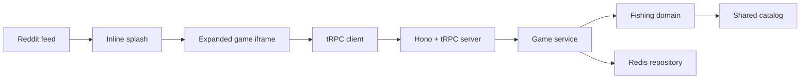

# King of River

King of River is a Reddit-first mini fishing game built with Devvit Web. It is a compact adaptation of the original RiverKing product idea for custom posts on Reddit: short fishing sessions, persistent per-post player state, collectible fish, locations, rods, and a path toward leaderboards, quests, clubs, and events.

The project starts from the official Devvit React template, but the starter counter has been replaced with a typed game foundation:

- React 19, Tailwind CSS 4, and Vite for the Reddit iframe client.
- Hono and Devvit Web server APIs for the serverless runtime.
- tRPC v11 for typed client/server game procedures.
- Redis-backed save state scoped by Reddit post and username.
- Shared TypeScript catalog/types for fish, locations, baits, rods, casts, challenges, and catch records.
- RiverKing source assets reused for the first playable Reddit surface.

Playtest subreddit:

- [r/king_of_river_dev](https://www.reddit.com/r/king_of_river_dev/?playtest=king-of-river)

Source inspiration:

- Local original: `/Users/hq-k14lcdcq7d/Documents/IdeaProjects/RiverKing`
- GitHub target: [anry88/king-of-river](https://github.com/anry88/king-of-river)

## What Exists Now

- Inline splash entrypoint in `src/client/splash.tsx`.
- Expanded game entrypoint in `src/client/game.tsx`.
- Shared tRPC router contract in `src/shared/trpc.ts` with Devvit context binding in `src/server/trpc.ts`.
- Game domain rules in `src/server/domain/fishing.ts`.
- Service orchestration in `src/server/services/gameService.ts`.
- Redis persistence in `src/server/storage/gameRepository.ts`.
- Shared game catalog and DTOs in `src/shared/game/`.
- First playable screen with `Пруд`, four base baits, original RiverKing location/fish/menu assets, and bottom tab placeholders.
- Moderator menu action to create a custom King of River post.
- Documentation map matching the original RiverKing repository style.

## Architecture



- `src/client/` owns Reddit iframe UI and lightweight hooks.
- `src/server/` owns Hono, tRPC, Devvit context access, Redis persistence, menu routes, and game services.
- `src/shared/` owns cross-runtime types and static catalog data.
- `public/riverking/` contains the first reused visual assets from RiverKing.
- `docs/` contains product and repository metadata notes.

## Core Loop

1. Open the inline post card.
2. Expand into the game.
3. Choose the current location and bait.
4. Cast a line at the current location.
5. Hook a fish and reveal rarity, weight, and a tap challenge.
6. Land or lose the fish.
7. Save coins, XP, discoveries, and recent catches in Redis.

## Commands

Make sure Node 22 is available.

```bash
npm run type-check
npm run lint
npm run build
npm run dev
```

Devvit commands:

- `npm run dev`: starts `devvit playtest`.
- `npm run deploy`: type-checks, lints, and uploads.
- `npm run launch`: deploys and publishes for review.
- `npm run login`: logs the CLI into Reddit.

## Documentation Map

- [DOCUMENTATION.md](DOCUMENTATION.md): engineering architecture and package map.
- [AGENTS.md](AGENTS.md): repo-level guide for coding agents.
- [docs/product-overview.md](docs/product-overview.md): product scope and roadmap.
- [docs/github-about.md](docs/github-about.md): suggested GitHub repository metadata.
- [src/client/README.md](src/client/README.md): client entrypoints and UI boundaries.
- [src/server/README.md](src/server/README.md): server runtime and route map.
- [src/server/domain/README.md](src/server/domain/README.md): pure game rules.
- [src/server/services/README.md](src/server/services/README.md): service layer.
- [src/server/storage/README.md](src/server/storage/README.md): Redis persistence.
- [src/shared/README.md](src/shared/README.md): shared catalog and DTOs.

## Roadmap

- Add daily rewards, per-post leaderboards, and tournament windows.
- Add quest and achievement services.
- Add club/event data structures adapted to Reddit communities.
- Add additional RiverKing locations and lightweight animations.
- Add tests for domain rules and repository serialization.
